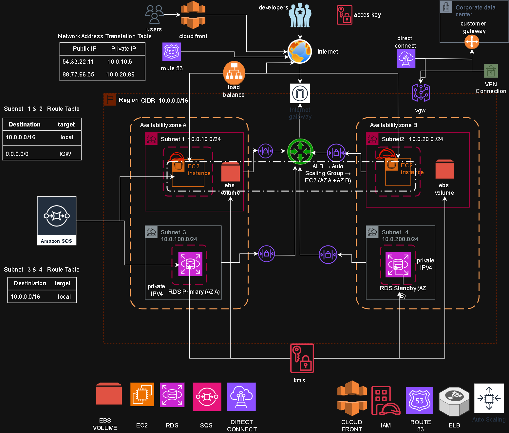

# AWS Multi-Tier Architecture (Highly Available & Scalable)

## 📌 Overview

This project presents a production-style design for a highly available, secure, and scalable multi-tier web application on AWS.
The architecture follows best practices for networking, security, performance optimization, and hybrid connectivity.

---

## 🧱 Architecture Design

### 🌐 Networking

* VPC: `10.0.0.0/16`
* Public Subnets:

  * `10.0.10.0/24` (AZ-A)
  * `10.0.20.0/24` (AZ-B)
* Private Subnets:

  * `10.0.100.0/24` (AZ-A)
  * `10.0.200.0/24` (AZ-B)
* Internet Gateway for public access
* NAT Gateway for outbound internet access from private subnets

---

### ⚖️ High Availability & Scalability

* Application Load Balancer (ALB) distributes traffic across:

  * EC2 instances in multiple Availability Zones
* Auto Scaling Group ensures:

  * High availability
  * Automatic scaling based on demand

---

### 🖥️ Compute Layer

* EC2 instances (EBS-backed) deployed across two AZs
* Instances handle both Web & Application tiers
* IAM Roles attached to EC2 for secure access to AWS services

---

### 🗄️ Database Layer

* Amazon RDS deployed in **Multi-AZ configuration**

  * Primary instance (AZ-A)
  * Standby instance (AZ-B) for failover
* Data encryption enabled using AWS KMS

---

### 🔄 Decoupling Layer

* Amazon SQS used to decouple application components
* Flow:

  * EC2 → SQS → (processing) → RDS
* Prevents database overload during traffic spikes

---

### 🚀 Performance Optimization

* Amazon CloudFront used as CDN
* Amazon Route 53 for DNS management
* Global users are routed efficiently with low latency

---

### 🔐 Security

* Security Groups (instance-level protection)
* Network ACLs (subnet-level protection)
* IAM Roles (no hardcoded access keys)
* Data encryption at rest (RDS, EBS, SQS via KMS)

---

### 🔗 Hybrid Connectivity

* AWS Direct Connect (primary, low latency)
* Site-to-Site VPN (backup connection over internet)
* Secure connection to on-premises datacenter

---

## 🖼️ Architecture Diagram

---

## 🎯 Key Features

* Multi-AZ High Availability
* Scalable Infrastructure (Auto Scaling)
* Secure Access Control (IAM, SG, NACL)
* Database Failover (RDS Multi-AZ)
* Decoupled Architecture (SQS)
* Global Performance Optimization (CloudFront)
* Hybrid Cloud Integration

---

## 🧠 Skills Demonstrated

* AWS Architecture Design
* Networking (VPC, Subnets, Routing)
* High Availability & Fault Tolerance
* Security Best Practices
* Cloud Scalability Patterns
* Hybrid Infrastructure Design

---

## 👨‍💻 Author

**Mohamed Gamal**
