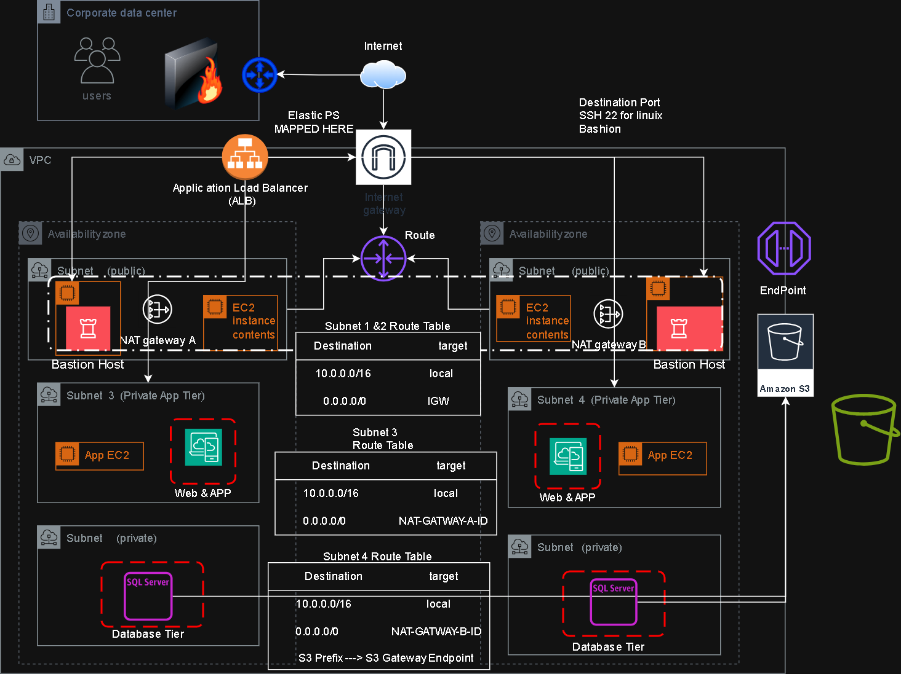

# 🖥️ Highly Available Two-Tier Web Architecture on AWS

## 📌 Project Overview
This project demonstrates the design and implementation of a secure, highly available, and fault-tolerant two-tier web application architecture on AWS within a single AWS Region.

The architecture is built using Amazon EC2 instances for both application and database layers, following AWS best practices for security, scalability, and high availability.

---
## 🏗️ Architecture Design

The system follows a **Two-Tier Architecture** deployed across multiple Availability Zones:

- **Application Tier**: Handles user traffic and application logic
- **Database Tier**: Secure backend layer deployed in private subnets with no direct internet access
---

## 📊 Architecture Diagram

---

## ☁️ AWS Services Used

- Amazon VPC
- EC2 Instances
- Internet Gateway (IGW)
- NAT Gateway
- Security Groups
- Network ACLs
- VPC Gateway Endpoint (S3)
- Amazon S3
- Route Tables
- Availability Zones (Multi-AZ design)
---

## 🔐 Security Design

### 1. Database Tier Isolation
- Database EC2 instances are deployed in private subnets
- No direct internet access
- Outbound internet access only via NAT Gateway for updates

### 2. Administrative Access Control
- SSH access is restricted to corporate data center IP range only
- No public SSH access allowed
- Controlled via Security Groups

### 3. Application-to-Database Communication
- Database access is restricted to Application Tier only
- Implemented using Security Group rules (least privilege access)

### 4. Secure S3 Access
- Database servers access S3 via VPC Gateway Endpoint
- Ensures traffic does not traverse the public internet

## 📈 High Availability & Fault Tolerance

- Multi-AZ deployment for improved availability
- EC2 instances distributed across multiple Availability Zones
- NAT Gateway enables secure outbound connectivity
- Designed to eliminate single points of failure

---
## 🔄 Architecture Flow

User → Internet Gateway → Application Tier (EC2) → Database Tier (EC2 Private Subnet) → S3 (via VPC Endpoint)
---
## 🚀 Key Features

- Highly Available and Fault-Tolerant Design
- Secure Private Database Layer (No Public Exposure)
- Controlled Administrative Access from Corporate Network
- Private AWS Service Connectivity (VPC Endpoint)
- Scalable EC2-based Architecture
 
---
## 🧠 Skills Demonstrated

- AWS VPC Networking & Architecture Design
- EC2 Deployment & Management
- Security Groups & Network ACLs Configuration
- High Availability Design (Multi-AZ)
- Cloud Security Best Practices
- Private Connectivity using NAT & VPC Endpoints
- Infrastructure Design based on AWS Well-Architected Framework
